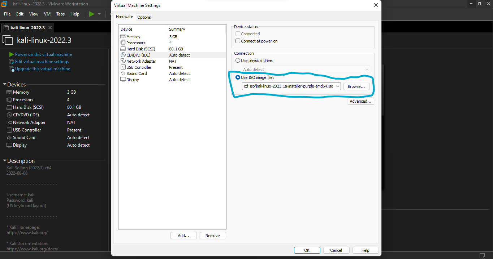

# Kali Purple Virtual Machines


The VMs have been uploaded to Mega.io. You can access them [here](https://mega.nz/folder/YnJjjLzB#IkjaH6In2SnQ2fkLprDk2A)


## Directory Structure
```bash
Kali-Purple-VMs
└──2023.1
   ├──Virtual box
   └──VMWARE
      ├──kali-linux-purple-2023.1-all.zip
      └──kali-linux-purple-2023.1-personalize.zip
```
## Instructions
- ### VMWare
	- #### <strong>*Kali Purple All*</strong>
		This has all the categories of the blue team tools installed.

		- Extract the VM files and move them to the folder you prefer (usually ~/Documents/Virtual Machines/)
		- Open VMWare Workstation and select open VM
		- Navigate to the directory you extracted the VM into and select the `.vmdk` file. 
		- When the VM has been loaded, you can change the settings (increase or decrease RAM, number of cores, storage size, etc...)
		- Power the VM
	- #### <strong>*Kali Purple Personalize*</strong>
		This gives you the options to choose which category of tools you prefer. This VM has been put in suspension mode so when booted it will continue from the stage where you have to choose the categories of tools of your choice. Please follow the instructions carefully to avoid errors.

		- Extract the VM files and move them to the folder you prefer (usually ~/Documents/Virtual Machines/)
		- Open VMWare Workstation and select open VM
		- Navigate to the directory you extracted the VM into and select the `.vmdk` file. 
		- When the VM has been loaded, click `CD/DVD (IDE)`
		
		- If it's `Auto detect`, switch to the `Use ISO image file`
		
		- Navigate to the directory of the extracted VM and locate the folder `cd_iso/`, the required ISO resides there.
		- Select it and click ok.
		- Power on VM and continue with the installation process.

		### NB: 
		Username: `kali`<br>
		Password: `kali`
- ## Virtual Box
	Coming soon!!!
