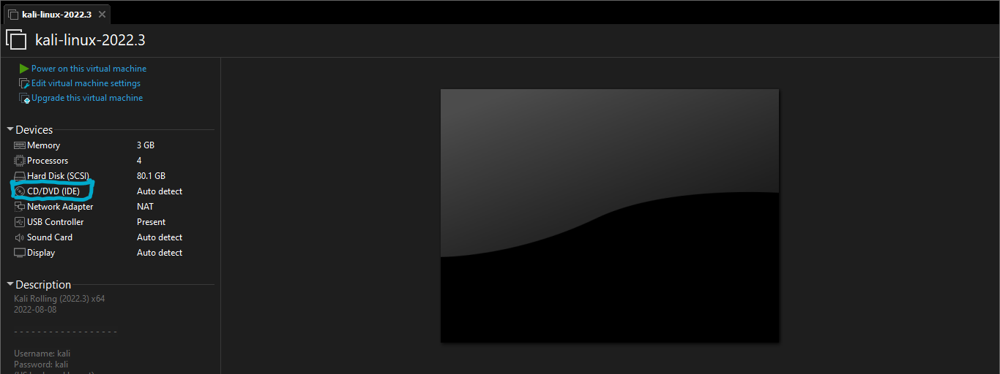

# Kali Purple Virtual Machines


The VMs have been uploaded to Mega.io. You can access them [here](https://mega.nz/folder/YnJjjLzB#IkjaH6In2SnQ2fkLprDk2A)

[](https://mega.nz/folder/YnJjjLzB#IkjaH6In2SnQ2fkLprDk2A)

## Why Use Kali Purple
Kali Purple, the new version of Kali that combines both red and blue teaming capabilities, offers several benefits for users engaged in offensive and defensive security tasks:

- **Comprehensive Toolset:** Kali Purple includes an expanded set of tools that cater to both offensive (red teaming) and defensive (blue teaming) security tasks. This provides users with a comprehensive arsenal of resources for various cybersecurity activities, ranging from penetration testing and vulnerability assessment to incident response and threat hunting.

- **Enhanced Blue Teaming Capabilities:** Kali Purple introduces a new set of tools specifically designed for blue teaming purposes, such as identifying, protecting, detecting, responding, and recovering from security incidents. - These tools are curated to support defensive security tasks, empowering blue teams to effectively defend against cyber threats and strengthen their security posture.

- **Integrated Offensive and Defensive Security:** Kali Purple seamlessly integrates offensive and defensive security capabilities, allowing users to switch between red and blue teaming tasks without needing to switch between different operating systems or toolsets. This streamlined approach enables users to efficiently assess their own systems for vulnerabilities (red teaming) and then implement appropriate defensive measures (blue teaming) to protect against potential attacks.

- **Customization Options:** During the installation process, Kali Purple allows users to select which categories of blue teaming tools they prefer to install, based on their specific requirements and preferences. This flexibility enables users to tailor their Kali Purple installation to their unique needs, optimizing the toolset for their blue teaming tasks.

- **Active Community Support:** Kali Linux has a large and active community of cybersecurity professionals who actively contribute to its development and provide support. This means that Kali Purple users can leverage the collective knowledge and expertise of the community for assistance, guidance, and troubleshooting, enhancing the overall user experience.

- **Availability of Virtual Machine Images:** While Kali Purple is only available as a bootable ISO and not as a pre-configured virtual machine, the availability of virtual machine images i have created provides users with a convenient way to set up Kali Purple in a virtualized environment, saving time and effort in the installation process.

Overall, the benefits of Kali Purple lie in its comprehensive toolset, integrated offensive and defensive security capabilities, customization options, and active community support, making it a powerful and versatile platform for red and blue teaming tasks in cybersecurity.

## Directory Structure
```bash
Kali-Purple-VMs
└──2023.1
   ├──Virtual box
   └──VMWARE
      ├──kali-linux-purple-2023.1-all.zip
      └──kali-linux-purple-2023.1-personalize.zip
```
## Instructions
- ### VMWare
	- #### <strong>*Kali Purple All*</strong>
		This has all the categories of the blue team tools installed.

		- Extract the VM files and move them to the folder you prefer (usually ~/Documents/Virtual Machines/)
		- Open VMWare Workstation and select open VM
		- Navigate to the directory you extracted the VM into and select the `.vmdk` file. 
		- When the VM has been loaded, you can change the settings (increase or decrease RAM, number of cores, storage size, etc...)
		- Power the VM
	- #### <strong>*Kali Purple Personalize*</strong>
		This gives you the option to choose which category of tools you prefer. This VM has been put in suspension mode so when booted it will continue from the stage where you have to choose the category of tools of your choice. Please follow the instructions carefully to avoid errors.

		- Extract the VM files and move them to the folder you prefer (usually ~/Documents/Virtual Machines/)
		- Open VMWare Workstation and select open VM
		- Navigate to the directory you extracted the VM into and select the `.vmdk` file. 
		- When the VM has been loaded, click `CD/DVD (IDE)`
		
		- If it's set to `Auto detect`, switch to the `Use ISO image file`
		
		- Navigate to the directory of the extracted VM and locate the folder `cd_iso/`, the required ISO resides there.
		- Select it and click ok.
		- Power on VM and continue with the installation process.


- ## Virtual Box
	Coming soon!!!

## NB:
Username: kali<br>
Password: kali 

If you have any issues, feedback or suggestions please create an issue here on Github and I will respond as expected.
